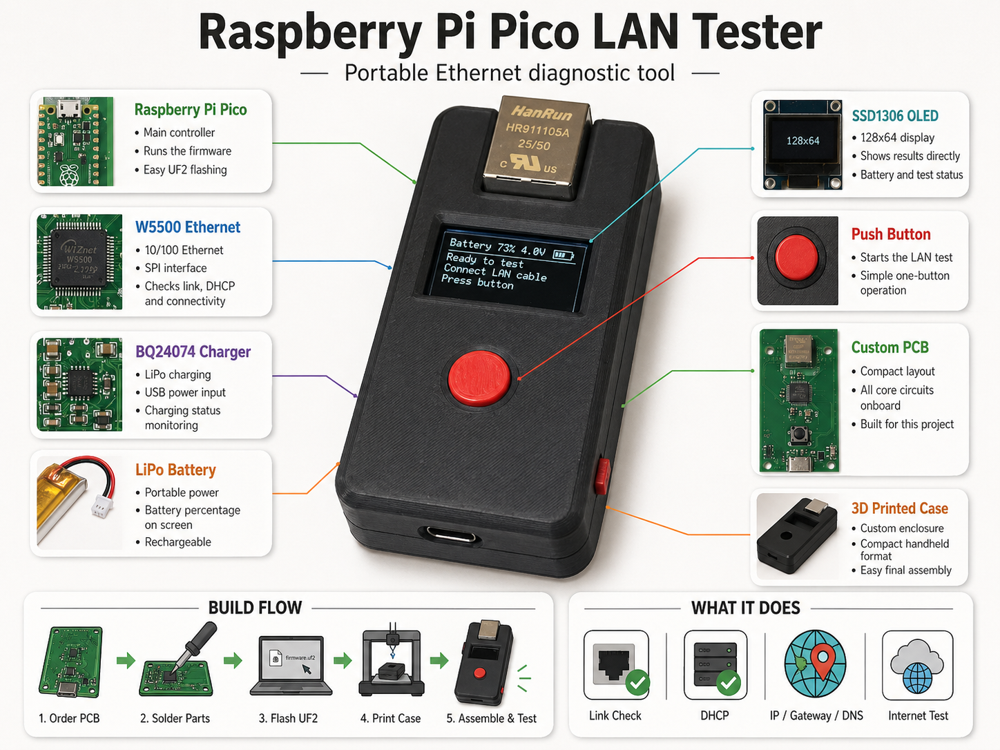

<div align="center">

# Raspberry Pi Pico LAN Tester

### Portable Ethernet diagnostic tool with `W5500`, `OLED`, battery charging and a custom PCB



<br>

<a href="https://www.instructables.com/Portable-Raspberry-Pi-Pico-LAN-Tester/">
  
</a>

</div>

---

## Overview

This is a compact handheld LAN tester based on a **Raspberry Pi Pico**, a **W5500 Ethernet controller**, an **SSD1306 OLED display** and **LiPo battery charging**.

It quickly checks whether an Ethernet port is actually working. The tester checks the physical link, requests an IP address with DHCP, shows IP / gateway / DNS information and performs a simple internet connectivity test.

---

## Main Features

- `W5500` Ethernet controller over SPI
- `SSD1306` 128x64 OLED display
- One-button LAN test
- Link, DHCP and internet check
- IP / Gateway / DNS display
- Battery voltage and charging status
- Custom PCB with Raspberry Pi Pico
- 3D printed enclosure

---

## Project Files

The repository contains the firmware and KiCad hardware files:

```text
LANTester/
├── Code/
└── KiCad/
```

`Code` contains the Raspberry Pi Pico firmware.  
`KiCad` contains the schematic, PCB and manufacturing files.

---

## Flashing

If the ready-built `LANTester.uf2` file is included, flashing is simple:

1. Hold **BOOTSEL** on the Raspberry Pi Pico.
2. Plug it into USB.
3. Copy `LANTester.uf2` to the Pico drive.
4. The Pico reboots and starts the firmware.

No special programmer is needed.

---

## Full Build Guide

The complete step-by-step guide is available on Instructables:

[https://www.instructables.com/Portable-Raspberry-Pi-Pico-LAN-Tester/](https://www.instructables.com/Portable-Raspberry-Pi-Pico-LAN-Tester/)

---

## 3D Printed Case

The 3D printed enclosure is available on Printables:

<a href="https://www.printables.com/model/1705220-raspberry-pi-pico-lan-tester">
  
</a>
---

## Notes

This repository contains the firmware and hardware files for the project.  
Photos, build steps and assembly instructions are documented in the Instructables guide.